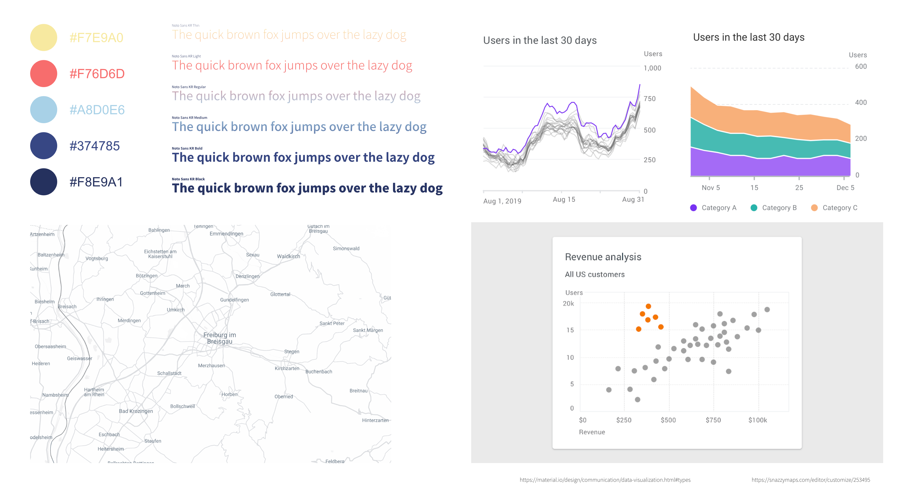

# freiefeiburgdaten

## Übersicht

Das Thema dieser Datenvisualisierung ist *Freizeitgestaltung junger Menschen in Freiburg*.

Die Anwendung ist online erreichbar unter [freiefreiburgdaten.de](https://freiefreiburgdaten.de/).

- [freiefeiburgdaten](#freiefeiburgdaten)
  - [Übersicht](#übersicht)
  - [Instalation und Ausführung](#instalation-und-ausführung)
  - [Visualisierung](#visualisierung)
    - [Konzept](#konzept)
    - [Moodboard](#moodboard)
  - [Implemenation](#implemenation)
    - [Architektur](#architektur)
    - [Umsetzung](#umsetzung)
      - [Evaluierung unseres Ansatzes](#evaluierung-unseres-ansatzes)
    - [Technische Details](#technische-details)
      - [Aufbau Daten](#aufbau-daten)
      - [Aufbau Logik](#aufbau-logik)
        - [Module](#module)
        - [Anpassen der Logik](#anpassen-der-logik)
      - [Stiele](#stiele)
  - [Datensätze](#datensätze)

## Instalation und Ausführung

The only requirements are Python 3.9 and pip.

```bash
curl https://raw.githubusercontent.com/ValentinKolb/freiefreiburgdaten/main/install.bash | bash
sudo systemctl start fff
```

## Visualisierung

### Konzept

Die Seite ist bewusst schlicht gestaltet: Es sollte immer genau eine, Möglichkeit geben, eine Aktion durchzuführen (z.B. die Ansicht zu wechseln). Diese sollte jedoch dann intuitiv mit einer guten discoverability sein.

Das grundsätzliche Konzept ist, dass es zu verschiedenen Orten individuelle Datensätze gibt, welche jeweils in einer eigenen Ansicht dargestellt werden. Zum Wechseln zwischen den Visualisierungen wird die Karte als Navigation genutzt. Durch Interagieren (z.B. klicken) mit den auf der Karte hervorgehobenen Orten können die ortsspezifischen Daten ausgewählt werden.

Da die Orte von einader sehr unterschiedlich sind, ist es nicht vorrangig die Daten einzelner Orte miteinander zu vergleichen. Aus diesem Grund wird der Platz auf der Seite genutzt, um die jeweiligen Orte individuell vielseitiger vorzustellen.

So kann die Visualisierung auch genau an den Ort und den jeweiligen Datensatz angepasst werden und es muss kein gemeinsamer Nenner zwischen allen Datensätzen gefunden werden, der es verunmöglicht ins Detail zu gehen.

Dies alles erzeugt ein zusammenhängendes und gleichzeitig individuelles und erweiterbares Bild.

Gerade der Polymorphismus bietet die Möglichkeit, die 'Microsite' beliebig auszubauen, jedoch ohne sie zu überladen. So kann die Karte einfach um andere Orte erweitert werden, ohne das eine individuelle Ansicht überfrachtet wird.

### Moodboard



## Implemenation

### Architektur

Bei der Umsetzung des Projektes wurde sich vor der Implementation gedanken über die Architektur gemacht. Dabei haben wir auch die folgenden Punkte wert gelegt:

- Wartbarkeit: Die Anwendung soll nicht nur einen Tag lang funktionierten. Sie soll so entwickelt werden, als ob sie an einen Kunden ausgeliefert wird. Dazu muss sie so programmiert sein, dass man sie gut Warten kann.
- Umsetzbarkeit: Eine schöne Idee ist nur dann etwas Wert, wenn man sie tatsächlich realisieren kann. Das heist jedoch nicht, dass man schwierig umzusetzende Vorschläge verwirft, sondern das man sie so modelliert, das sie leicht um zusetzten sind.
- Wiederverwendbarkeit: Die entwickelte Software soll modular aufgebaut sein. Dabei sollen die einzelnen Module so gekapselt sein, dass sie individuell wiederverwendet werden können.

### Umsetzung

Unter diesem Punkt wird konkret beschrieben, wie die gewünschte Architektur umgesetzt wurde.

Um die im vorherigen Kapitel aufgelisteten Eigenschaften zu erfüllen, hat ein Prinzip die Struktur unserer Anwendung maßgeblich beeinflussen: die Trennung von Logik und Daten.

Dieses Prinzip haben wir auf die Spitze getrieben! Was wir letztendlich entwickelt haben, ist ein Framework, das OHNE jegliche Anpassung die Daten von einem beliegen Stadt anzeigen kann!

Die von uns gebaute Logik, die auch für die Visualisierung zuständig ist, passt sich automatisch an den gegebenen Daten an. Außerdem kann ihr Verhalten mithilfe von Konfigurationsdateien individualisiert werden. Damit müssen lediglich die Daten ausgetauscht werden, um Orte eine andere Stadt zu visualisieren.

#### Evaluierung unseres Ansatzes

Wieder erwartend hat unser Ansatz nicht mehr arbeit bedeutet, als eine Seite zu entwickeln, die nicht so einfach wiederverwendet werden kann. Im Gegenteil - diese Strategie hat viele Vorteile mit sich gebracht:

- Einfaches paralleles Entwickeln: Auch die Logik selbst ist in einzelne Module aufgeteilt. Es bestand also immer die Möglichkeit, getrennt voneinander an verschiedenen Aspekten zu Entwickeln.
- Klare Struktur: Aufgrund des geregelten Aufbaues ist immer klar, wo welche Informationen und Aspekte der Anwendung zu finden sind.
- Trennung von Verantwortung: Auftretende Fehler sind leicht zu finden, da aufgrund der klaren Struktur geregelt ist, welcher Teil der Anwendung für welche Aufgabe zuständig ist.

Das Umsetzten dieses Ansatzes hat uns jedoch auch die Chance geben, Schwierigkeiten dabei zu erfahren:

- Eine klare Architektur ist notwendig: Wenn die Anwendung so aufgebaut sein soll, ist es nicht möglich einfach drauf los zu coden. Es ist notwendig, sich Gedanken darüberzumachen, wie genau sie aufgebaut werden soll. Dies ist jedoch nicht unbedingt etwas Negatives!
- Individualisierung ab einem bestimmten Grad schwieriger: Zurückblickend auf die Entwicklung können wir sagen, dass wir in der Zeit, die wir zur Verfügung hatten, das bestmögliche Produkt entwickelt haben - unabhängig von dem Ansatz. Dennoch ist abzusehen, dass wenn die Anwendung noch weiter auf Freiburg zugeschnitten werden soll - besonders wenn es um Features geht, die nur für Freiburg und keine andere Stadt gelten sollen - dies mit mehr Aufwand verbunden sein sollte, als wenn die Anwendung von Anfang an komplett auf diese Stadt ausgelegt wäre.

Anschließend können wir sagen, dass wir sehr zufrieden mit unserer Abgabe sind. Die Chance, das Projekt so um zusetzten, wie wir es wollten, und der Freiraum, der uns dafür geben wurde, hat es und ermöglicht an dem Konzept zu wachsen.

### Technische Details

In diesem Abschnitt werden Details der technischen Umsetzung beschrieben. Dazu gehört Aufbau des Projektes und verwendete Software.

Das Projekt wurde in der Programmiersprache Python implementiert. Der Programmcode und die Daten befinden sich im `src` Ordner dieses Projektes.

#### Aufbau Daten

Alle für die Anwendung genutzen Daten befinden sich im Ordner `src/data`. Im Mittelpunkt aller Datensätze befindet sich die `meta.json` Datei. Diese wird als Erstes vom Programm eingelesen und bestimmt, wie sich das Programm verhält. Auf den Aufbau dieser Datei und deren Bedeutung soll nun etwas genauer eingegangen werden.

```json
{
  "default": {
      {
        "name": "the title of the application",
        "description": {
          "shortDescription": "_ignored",
          "description": "/path/of/detailed/description_of_city.md",
          "source": "www.DetailedCityDescription.de"
        }, 
        ...
      }
  },
  "places": [
    {
      "name": "the name of the place",
      "description": {
        "shortDescription": "short hover info of location",
        "description": "/path/of/detailed/description.md",
        "source": "www.DetailedDescription.de"
      },
      "category": [
        "custom category 1",
        "custom category 2",
        "..."
      ],
      "location": {
        "lat": "the latitude of the location",
        "long": "the longitude of the location"
      },
      "data": [
        {
          "identifier": "name of DataSheet",
          "startYear": first Year of Data,
          "endYear": last Year of Data,
          "dataSheet": "/path/of/CSV",
          "separator": ";",
          "encoding": "the text encoding of the CSV file",
          "source": "human readable source",
          "sourceLink": "www.DataSheetLink.de",
          "graph": {
            "type": "the type of the graph to use"
          }
        }
      ]
    },
    {
      ...
    }
  ]
}
```

Die JSON Datei enthält zwei primäre Schlüsse. Einmal "default" und einmal "places". Der "places" Schlüssel erlaubt zugriff auf ein Array, das JSON-Objekte enthält. Jedes dieser Objekte steht dabei für Ort auf der Karte. Der "default" Schlüssel verweist direkt auf ein solches JSON-Objekt, das aus Gründen der Lesbarkeit in dieser Datei teilweise ausgelassen wurde. Der Aufbau des Default-Objektes und der anderen Ort-Objekte ist identisch.

Das Orte-Array kann beliebig viele Orte enthalten und diese wieder beliebig viele Datensätze in dem "data"-Array. So ist es auch möglich zu einem Ort mehrere Graphen anzeigen zu lassen. Diese werden dann ganz einfach untereinader gerendert.

Nun soll auf einige Details des Ort-Objektes eingegangen werden.

Über "name" kann der Name des Ortes festgelegt werden.

Was beim Hovern über einen Ort angezeigt wird, hängt von der aktuellen Zoom-Stufe der Karte ab. Wenn hinnen gezoomt ist, wird der Names des Ortes permanent angezeigt und beim hover die "shortDescription". Wenn hinaus groomed ist, wird beim Hovern der Name des Ortes angezeigt, welches in diesem Fall sonst verborgen ist.

Außerdem kann einem Ort auch eine ausführliche Beschreibung hinzugefügt werden. Dies wird über einen Link zu einer Markdown Datei signalisiert, die in HTML auf der Seite gerendert wird. Markdown ist dabei sehr Nutzerfreundlich und bietet die Möglichkeit, wenn nötig auf CSS-Stiele zugreifen zu können. Damit ist es simpel und mächtig zugleich.

Über "category" können einem Ort beliebig viele Kategorien gegeben werden, mit denen der Nutzer filtern kann.

Der "location"-Schlüssel kontrolliert, wo auf der Karte der Ort eingezeichnet wird. Beim "default"-Ort sind diese Werte die Kartenmitte beim Öffnen der Anwendung. So kann beim Anzeigen einer anderen Stadt die Kartenmitte einfach verändert werden.

Schließlich können einem Ort Daten-Objekte in dem "data"-Array zugewiesen werden. Auch hier wird alles in dieser Datei kontrolliert und ist somit ohne Verändern des Programmcodes anpassbar! Die Daten selbst werden in CSV-Dateien gespeichert. Wir haben uns bewusst gegen eine Komplexe Datenbank entschieden, da auch die meisten Kommunen ihre Daten direkt in CSV bereitstellen.

Bei der CSV wird immer die erste Spalte als x-Achse interpretiert und die weiteren Spalten auf der y-Achse im verhältnis zu der ersten Spalte angezeigt.

Damit die Dateien richtig geladen werden können und nicht vor dem Laden umformatiert werden müssen, kann das "encoding" und der "separator" angeben werden.

Über "startYear" und "endYear" kann spezifiziert werden, für welchen Zeitraum dieser Datensatz Daten enthält. Auch nach dieser Metrik kann letztendlich vom Nutzer gefiltert werden.

Schlussendlich kann sogar das Aussehen des Graphen direkt in der `meta.json` Datei geändert werden. Dafür ist das "graph"-Attribute des Daten-Objektes zuständig. Hier kann für jeden Datensatz individuell bestimmt werden, welche Art von Graph für die Visualisierung genutzt wird. Verfügbare Arten sind dabei "line", "bar", "funnel", "scatter" oder "histogram".

#### Aufbau Logik

Der Startpunkt der Logik befindet sich in der Datei `src/app.py`. Hier wird der Main-Prozess erstellt und die App gestated. Außerdem wird in dieser Datei das Layout der Anwendung definiert und Funktionen bereitgestellt, die die Anwendung interaktiv machen.

Aller weiteres Code befindet sich in Modulen. Diese sind im Ordner `src/modules/` zu finden. Im Folgenden sollen die einzelnen Module kurz vorgestellt werden. Eine genaue beschreibung findet sich im Code selbst, in der weitverbreiteten Numpy-Notation.

##### Module

- argument_module: Dieses Modul erlaubt das Anpassen der Anwendung durch Kommandozeilen-Parameter und Umgebungsvariablen. Dazu später mehr ...
- data_module: Dieses Modul beinhaltet Funktionen von Filtern und Sortieren von Daten. Dabei kann es Daten nach Jahr und Kategorie Filtern, außerdem kann es alle Kategorien für ein bestimmtes Jahr finden.
- file_module: Dieses Modul stelle Interfaces zu Arbeiten mit Daten bereit. Um die Anwendung gleiche zeitig responsiv und Memory-Arm zu machen, verwendet es beim Laden von Dateien einen LRU-Cache.
- logging_module: Wie der Name schon sagt, ist dieses Modul für das Loggin zuständig.
- style_module: Dieses Module definiert globale Stile.

##### Anpassen der Logik

Einige Parameter der Logik lassen sich durch Kommandozeilen-Parameter und/oder Umgebungsvariablen anpassen.
Dabei werden immer erst die Kommandozeilen-Parameter berücksichtigt.

Für das Anzeigen der Kommandozeilen-Parameter kann die `--help` Flag genutzt werden.

Die Umgebungsvariablen sind:

- DASH_DEBUG: Wenn diese Variable auf `True` gesetzt ist, wird der Debug Modus eingeschaltet. Dies setzt das Log-Level auf Debug, schaltet den Dash eigenen Debug-Modus ein und zeigt einen weiteren Button im UI an. Durch Betätigen dieses Buttons werden alle Datei-Caches gelehrt und die `meta.json` Datei neu geladen. Dies ist besonders nützlich, wenn zum Beispiel verschiedene Grafen-Stile ausprobiert werden sollen und man dafür nicht die App jedes Mal neu laden möchte.
- DASH_META_JSON: Mit dieser Variable kann ein Pfad zu seiner eigenen `meta.json` Datei angeben werden. Damit kann die Anwendung einfach einer anderen Stadt angepasst werden.
- DASH_MAPBOX_API: Hiermit kann/muss der Mapbox API Token angebenden werden. Der default Token funktioniert nur für die Domain `freiefreiburgdaten.de`
- DASH_MAPBOX_STYLE: Dies ist der Mapbox Token für den Map-Stiel. Hiermit kann der Stil der Karte angepasst werden.

#### Stiele

Alle Style in CSS befinden sich in dem Ordner 'src/assets'. Der Stiel der Karte muss über das setzten des Style-Tokes angepasst werden.

## Datensätze

In unserer Anwendung wurden die folgenden Datensätze eingebunden. Die Quellen der Datensätze lassen sich auch immer bei der jeweiligen Visualisierung finden.

- Generell
  - [Bevölkerungsdichte](https://fritz.freiburg.de/asw/asw.exe?aw=Flaechennutzung/Region_Bevoelkerungsdichte)
- Freizeit und Sport
  - [Kinos ab 2008](https://fritz.freiburg.de/asw/asw.exe?aw=Kultur/JB_Kinos_ALLE_ASW)
  - Theater
    - [Wallgrabentheater seit 1976](https://fritz.freiburg.de/asw/asw.exe?aw=Kultur/JB_Wallgrabentheater)
    - [Theater im Marienbad seit 1992](https://fritz.freiburg.de/asw/asw.exe?aw=Kultur/JB_Theater_Marienbad)
    - Eigenbetrieb Theater
      - [Eigenbetrieb Theater Freiburg - Besucher seit 1976](https://fritz.freiburg.de/asw/asw.exe?aw=Kultur/JB_EB_Theater_Besucher)
      - [Eigenbetrieb Theater Freiburg - Vorstellungen seit 1976](https://fritz.freiburg.de/asw/asw.exe?aw=Kultur/JB_EB_Theater_Vorst)
      - [Eigenbetrieb Theater Freiburg seit 1976](https://fritz.freiburg.de/asw/asw.exe?aw=Kultur/JB_Eigenbetrieb%20Theater)
    - [Cala Theater seit 1989](https://fritz.freiburg.de/asw/asw.exe?aw=Kultur/JB_CALA_THEATER)
  - Bäder
    - [Städtische Bäder ab 2000](https://fritz.freiburg.de/asw/asw.exe?aw=Sport/JB_Baeder)
  - Kultur
    - [Kunstaustellung seit 1981](https://fritz.freiburg.de/asw/asw.exe?aw=Kultur/JB_Kunstausstellungen)
    - [Städtische Museen ab 1981](https://fritz.freiburg.de/asw/asw.exe?aw=Kultur/JB_Museen)
    - [Planetarium seit 1982](https://fritz.freiburg.de/asw/asw.exe?aw=Kultur/JB_Planetarium)
    - [Alemannische Bühne seit 1981](https://fritz.freiburg.de/asw/asw.exe?aw=Kultur/JB_Alemannische_Buehne)
    - [Konzerthaus Freiburg - Besucher](https://fritz.freiburg.de/asw/asw.exe?aw=Kultur/JB_Konzerthaus_Besucher)
    - [Zeltmusikfestival seit 1983](https://fritz.freiburg.de/asw/asw.exe?aw=Kultur/JB_Zeltmusikfestival)
  - Sport
    - [Sportvereine seit 1970](https://fritz.freiburg.de/asw/asw.exe?aw=Sport/JB_Sportvereine)
  - Verkehr
    - [Straßen und Radewege in km seit 1985](https://fritz.freiburg.de/asw/asw.exe?aw=Verkehr/JB_VERKEHR_STRASSEN)
- Nachhaltigkeitsindex
  - [Kultur und Sport](https://fritz.freiburg.de/asw/asw.exe?aw=Nachhaltigkeit/Freiburger_Nachhaltigkeitsindikatoren&@Feld=12)
