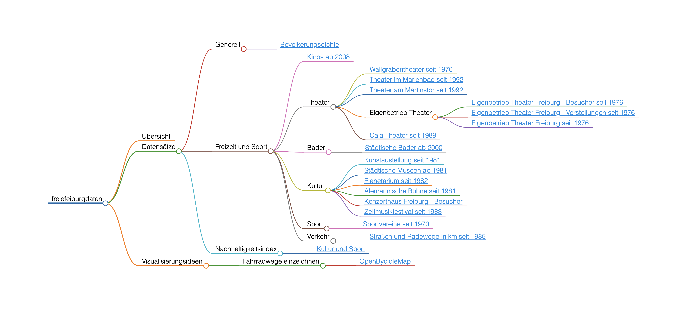

# freiefeiburgdaten

## Übersicht

Das Thema dieser Datenvisualisierung ist *Freizeitgestaltung junger Menschen in Freiburg*.

## Datensätze

* Generell
  * [Bevölkerungsdichte](https://fritz.freiburg.de/asw/asw.exe?aw=Flaechennutzung/Region_Bevoelkerungsdichte)
* Freizeit und Sport
  * [Kinos ab 2008](https://fritz.freiburg.de/asw/asw.exe?aw=Kultur/JB_Kinos_ALLE_ASW)
  * Theater
    * [Wallgrabentheater seit 1976](https://fritz.freiburg.de/asw/asw.exe?aw=Kultur/JB_Wallgrabentheater)
    * [Theater im Marienbad seit 1992](https://fritz.freiburg.de/asw/asw.exe?aw=Kultur/JB_Theater_Marienbad)
    * Eigenbetrieb Theater
      * [Eigenbetrieb Theater Freiburg - Besucher seit 1976](https://fritz.freiburg.de/asw/asw.exe?aw=Kultur/JB_EB_Theater_Besucher)
      * [Eigenbetrieb Theater Freiburg - Vorstellungen seit 1976](https://fritz.freiburg.de/asw/asw.exe?aw=Kultur/JB_EB_Theater_Vorst)
      * [Eigenbetrieb Theater Freiburg seit 1976](https://fritz.freiburg.de/asw/asw.exe?aw=Kultur/JB_Eigenbetrieb%20Theater)
    * [Cala Theater seit 1989](https://fritz.freiburg.de/asw/asw.exe?aw=Kultur/JB_CALA_THEATER)
  * Bäder
    * [Städtische Bäder ab 2000](https://fritz.freiburg.de/asw/asw.exe?aw=Sport/JB_Baeder)
  * Kultur
    * [Kunstaustellung seit 1981](https://fritz.freiburg.de/asw/asw.exe?aw=Kultur/JB_Kunstausstellungen)
    * [Städtische Museen ab 1981](https://fritz.freiburg.de/asw/asw.exe?aw=Kultur/JB_Museen)
    * [Planetarium seit 1982](https://fritz.freiburg.de/asw/asw.exe?aw=Kultur/JB_Planetarium)
    * [Alemannische Bühne seit 1981](https://fritz.freiburg.de/asw/asw.exe?aw=Kultur/JB_Alemannische_Buehne)
    * [Konzerthaus Freiburg - Besucher](https://fritz.freiburg.de/asw/asw.exe?aw=Kultur/JB_Konzerthaus_Besucher)
    * [Zeltmusikfestival seit 1983](https://fritz.freiburg.de/asw/asw.exe?aw=Kultur/JB_Zeltmusikfestival)
  * Sport
    * [Sportvereine seit 1970](https://fritz.freiburg.de/asw/asw.exe?aw=Sport/JB_Sportvereine)
  * Verkehr
    * [Straßen und Radewege in km seit 1985](https://fritz.freiburg.de/asw/asw.exe?aw=Verkehr/JB_VERKEHR_STRASSEN)
* Nachhaltigkeitsindex
  * [Kultur und Sport](https://fritz.freiburg.de/asw/asw.exe?aw=Nachhaltigkeit/Freiburger_Nachhaltigkeitsindikatoren&@Feld=12)

## Visualisierungsideen

* Fahrradwege einzeichnen
  * [OpenBycicleMap](https://www.openstreetmap.org/search?query=freiburg#map=12/47.9874/7.7965&layers=C)

## Mindmap

## Moodboard

