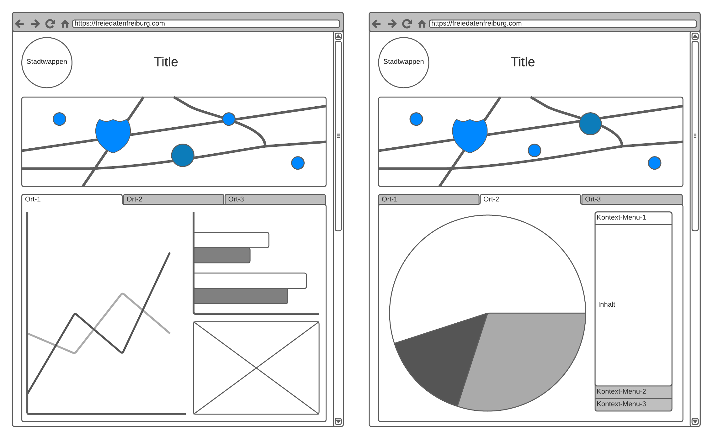

# freiefreiburgdaten

Dieses Projekt nutzt Python3 und die Dash-Bibliothek um öffentlich einsehbare Statistiken der Stadt Freiburg zu visualisieren.

## Persona

Um die Datenvisualisierung zu spezifizieren soll sich diese an eine spezielle Zielgruppe wenden, representatik dahrgestellt durch die folgende Persona:

Alexandra, Studentin, 20 Jahre alt aus Berlin. Sportlich, liegt gern in der Sonne am See, am liebsten fährt sie mit dem Fahrrad. Sie beginnt im WS 2021/2022 an der Uni Freiburg Altertumswissenschaften zu studieren. Über die Microsite will sie Freiburg etwas besser KennenlernenInformationen, die für Alexandra von Interesse sein könnten:

* Infos zur Uni Freiburg
  * Studierende
  * Studiengänge
  * Hochschulsport
* Infos zur Universitätsbibliothek
  * Bestand
  * Öffnungszeiten
  * ...
* Allgemeine Informationen zu Freiburg
* Fahrradwege
* Badeseen

## Mindmap

todo

## Pen and Paper Entwurf

Die Seite ist bewusst einfach gestalted: Es sollte immer genau eine, Möglichkeit geben,
eine Aktion durchzuführen (z.B. die Ansicht zu wechseln). Diese sollte jedoch dann intuitiv 
mit einer guten discouverbility sein. 

Das grunsätzliche Konzept ist, dass es zu verschiedenen Orten individuelle Datensätze gibt,
welche jeweils in einer eigenen Ansicht dahrgestellt werden. Zum Wechseln zwischen den Visualisierungen 
wir die Karte genutzt. Durch Interagieren (z.B. klicken) mit den auf der Karte hervorgehobenen Orten 
können die ortspezifichen Daten geswitched werden.

Da die Orte von einader sehr unterschiedlich sind, ist es nicht vorrangig die Daten einzelner Orte 
miteinander zu vergleichen. Aus diesem Grund wird der Platz auf der Seite genutzt die jeweiligen Orte
individuell vielseitiger vorzustellen. 

Mögliche Orte sind:
* Universität
* Bibliothek
* Einkaufszentrum
* Badesee
* Ämter
* ...

So kann die Visualisierung auch genau an den Ort und den jeweilgen Datensatz angepasst werden und 
es muss kein gemeinsammer Nenner gefunden werden, der es verunmöglicht ins Detail zu gehen.

Dies alles erzeugt ein zusammenhängendes und gleichzeitig individuelles und erweiterbares Bild.

Gerade der Polymorphismus bietet die Möglichkeit, die 'Microseite' beliebig auszubauen, jedoch immer noch clean
zu gestalten. So kann die Karte einfach um weitere Orte erweitered werden, ohne das eine individuelle Ansicht 
überladen wird.

Hinweis: Die in der Skizze verwendete 'Tap-Bar' dient nur der Veranschaulichung und soll nicht in die finale
Version aufgenommen werden.